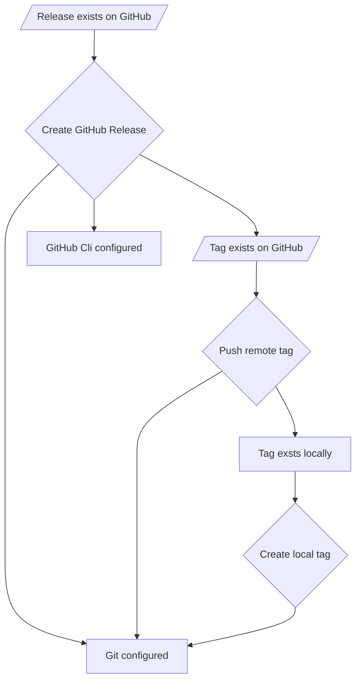
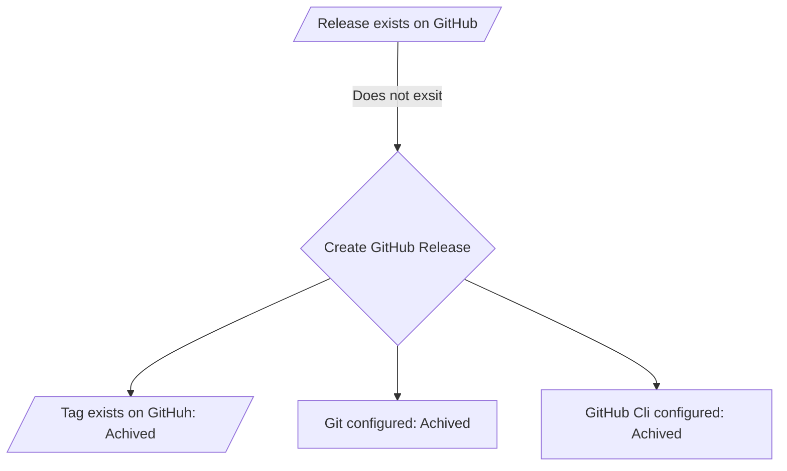

# Release tool

Create an executable that provides high-level and content-focused controls for
creating releases from repositories using IOGX.

## Motivation

For engineers focused on the development and maintenance of a product, releases
are only a means to distribute their works in a way that they are strongly
associated with an identifier that is fit uses when communicating with users
(typically a version number).

For these engineers, any actions they have to take or decisions they have to
make, that don't provide real control over what works are distributed in
releases and when releases are made, are complexities they face in pursuit of
their goal.

To manage these complexities engineers require knowledge that is very irrelevant
to the products they support and other complexities the manage frequently.

We seek to remove those complexities from those engineers' workflows while
providing controls useful for controlling what works are distributed in
releases.

## Exclusions

### Release Scheduling

There is a need for better solutions for release scheduling, but this ADR will
focus on providing a solution that integrates well with the tools and processes
the smart contracts teams are already using to schedule release, mainly Github
Actions and manually creating releases.

## Current state

Currently, iogx does not provide any utilities for users to create software
releases. This leaves users to manually create software releases, document
complex releases processes and create custom release automation configurations
and scripts, or get assistance from SCDE to do so.

Not all repositories create any notion of a release, but the ones that do,
preform releases with a few methods.

- Manually preform specific actions to create releases according to specific
desired outcomes.
- Manually preform specific actions to create releases according to a notion of
convention across IOG or wider contexts.
- Manually preform specific actions to create releases according to documented
processes.
- Creating custom release scrips and manually invoking them.
- Configuring GitHub actions to automatically invoked custom release scripts on
specific events and schedules and under specific conditions.

The manually processes are prone to errors and in-material inconsistencies from
release to release. This is because manually creating release is a processes
that is contains many decisions and processes and is typically preformed
in-frequently. Meaning it is a task that engineers likely have not done in a
while, and have to make a lot of un-familiar decisions to complete.

Fallowing conventions can help provide some consistency and prevent some
errors and fallowing a documented process helps even more so, but when a
engineer manually preforms these steps there is a chance for novel hard to
debug issues to affect releases.

The projects that use release scrips and automations can provide more consistent
error-free releases, and with less of a burden on everyone supporting the
releases for the project, per release. The issue with the projects that have
automations is that the automation code for every project is separate but seeks
to achieve similar results and very detailed in how to produce releases.

The automation code being very detailed in how to produce releases leads to
projects seeking support from SCDE. This means that both the team owning the
project and SCDE has to be involved in maintaining the release automations for
the project. This leads to the SCDE team having to provide direct support for
most projects that have release automations. Given that each project has its own
separate automation code, this means that the SCDE team is given a lot of
maintenance burden between all the projects producing releases, and faces
scaling issues with the growth of the number of projects producing releases.

## Solution

Create system that provides users with high-level and content-focused controls
for creating releases from repositories that use IOGX. When invoked, the
system ensures that the appropriate works are distributed according to the users
use of the [Controls](#controls) and in a way that associates their works to an
[Release Identifier](#release-identifier) specified by the user.

### Concrete solution

An executable named `create_release`.

#### Parameters

##### `RELEASE_ID` (Param)

- Position: 0
- Type: String
- Required

The [Release Identifier](#release-identifier).

#### Release Configuration

The [Release Configuration](#release-configuration) acts that the main set of
[Controls](#controls) provided to the user. As [Controls](#controls), the values
user provides for the [Release Configuration](#release-configuration) determines
which [Objectives](#objective-notion) are [User Objectives](#user-objective),
what parameters are used in those [Objectives](#objective-notion) and ultimately
what the contents of the [Release Plan](#release-plan).

For the `create_release` executable to work their needs to be a `release.yml` or
`release.yaml` file at the root of the git repository using IOGX.

The release configuation file will have the fallowing options...

##### `title.prefix`

- Type: String
- Default: Empty String

A prefix combined with the [Release Identifier](#release-identifier)
to form a release title to be used in content where human readability is important.

##### `description.text`

- Type: String
- Default: Empty String

A description of the release.

##### `description.include-github-generated-release-notes`

- Type: Bool
- Default: False

Whether to include the release notes generated by GitHub in the descriptions of
the release.

##### `git.tag.always-publish`

- Type: Bool
- Default: False

If the git tag should be published even if no release objectives call for it.

##### `git.tag.prefix`

- Type: String
- Default: Empty String

A string prepended to the [Release Identifier](#release-identifier) to
form the git tag representing the release in git repositories.

##### `github.release.always-publish`

- Type: Bool
- Default: False

If the GitHub release should be published even if no other release objectives
call for it.

##### `github.release.assets`

- Type: Mapping (String -> `flake-output-path`)
- Default: Empty Map

A mapping from the desired name of the asset in the GitHub release to the file
to exist under that asset name.

> Note: All values (`flake-output-path`s) must resolve to files.

<!-- -->
> Note: There cannot be any naming conflicts between names to be used as asset
names in the GitHub release.

Example

The configuration...

```yaml
github:
  release:
    assets:
      foo-x86_64-linux:
        output: packages.x86_64-linux.foo
        path: /lib/foo.so
      foo2-x86_64-linux:
        output: packages.x86_64-linux.foo
        path: /lib/foo2.so
      bar:
        output: packages.x86_64-linux.bar
      biz-x86_64-linux: biz
```

results in the files at these paths being uploaded to GitHub.

```console
/nix/store/XXXXXXXX-foo-derivation/lib/foo.so -> foo-x86_64-linux
/nix/store/XXXXXXXX-foo-derivation/lib/foo2.so -> foo2-x86_64-linux
/nix/store/XXXXXXXX-bar-derivation -> bar
/nix/store/XXXXXXXX-biz-derivation -> biz-x86_64-linux
```

###### `flake-output-path` Type

In the release configuration file, a `flake-output-path` is a value that
represents a node from a path in a derivation accessible from a project's flake
`outputs`. To use the node, the derivation needs to be built first.

A `flake-output-path` value can take one of the forms...

1. A string representing a selector of a derivation from the flake's `outputs`
2. A map containing the keys
    - `output` - A string representing a selector of a derivation from the flake's
    `outputs`.
    - `path` - An optional file path that will be used to select a file from the
    derivation once it has been built.

Examples

```yaml
- apps.x86_64-linux.foo
- output: devShell.x86_64-linux
- output: packages.x86_64-linux.bar
  path: /bin/bar
- output: packages.x86_64-linux.bizz
  path: /lib
```

#### Intrinsics

##### Indicators

###### Allways publish git tag (Indicator)

When [`git.tag.always-publish`](#git.tag.always-publish) is `True`, include
[Tag exists on GitHub](#Tag-exist-on-GitHub).

###### Allways publish GitHub release (Indicator)

When [`github.release.always-publish`](#github.release.always-publish) is `True`,
include [Release exists on GitHub](#release-exists-on-github).

###### Assets to publish (Indicator)

When [`github.release.assets`](#github.release.assets) is not the Empty Map,
include [Release exists on GitHub](#release-exists-on-github).

##### Objectives

###### Release exists on GitHub

A release is on GitHub for the HEAD commit, tagged with the release tag, with
the appropriate contents.

Check if release exists on GitHub

- If it does not exist, achieve via [Create GitHub release](#create-github-release)
- If it does exist, not achievable.

###### Tag exists on GitHub

A git tag for the HEAD commit, with the appropriate contents, is publish to
public git repositories.

- Check if tag exists on GitHub
  - If it does not exist, achieve via [Push remote tag](#push-remote-tag).
  - If it does exist, check if it is as expected
    - If it is, achieved.
    - If it is not, not achievable.

###### GitHub Cli configured correctly

- Check if the GitHub Cli is configured correctly
  - If it is, achieved.
  - If it is not, not achievable.

###### Tag exists locally

- Check if tag exists locally
  - If it does not exists, achieve via [Create local tag](#create-local-tag).
  - If it does exists, check if it is as expected
    - If it is, achieved.
    - If it is not, not achievable.

###### Git configured correctly

- Check if git is configured correctly
  - If it is, achieved.
  - If it is not, not achievable.

##### Changes

###### Create GitHub release

Create a release on appropriate GitHub repo.

- Preconditions
  - [Git configured correctly](#git-configured-correctly)
  - [GitHub Cli configured correctly](#github-cli-configured-correctly)
  - [Tag exists on GitHub](#tag-exists-on-github)
- Actions

  ```console
    gh release create ${git.tag.prefix+RELEASE_ID} \
      -t ${title.prefix+RELEASE_ID}
      -n "${description.text+if description.include-github-generated-release-notes then \n GitHub generate release notes}"
      PATHS_TO_ASSETS
  ```

- Success Checks
  - `gh release view ${git.tag.prefix+RELEASE_ID}`
- Revert Actions
  - `gh release delete ${git.tag.prefix+RELEASE_ID}`

###### Push remote tag

Push tag to remote repositories

- Precondition
  - [Git configured correctly](#git-configured-correctly)
  - [Tag exists locally](#tag-exists-locally)
- Actions
  - `git push origin ${git.tag.prefix+RELEASE_ID}`
- Success Checks

  ```console
    git ls-remote \
      --exit-code \
      origin \
      refs/tags/${git.tag.prefix+RELEASE_ID}
  ```

- Revert actions
  - `git push origin -d ${git.tag.prefix+RELEASE_ID}`

###### Create local tag

Create tag locally

- Precondition
  - [Git configured correctly](#git-configured-correctly)
- Actions

  ```console
      git tag \
        -a ${git.tag.prefix+RELEASE_ID} \
        -m "${description.text+if description.include-github-generated-release-notes then \n GitHub generate release notes}"
  ```

- Success Checks

  ```console
    release_commit=$(git rev-list -1 ${git.tag.prefix+RELEASE_ID})
    head_commit=$(git rev-parse HEAD)
    [ $release_commit = $head_commit ]
  ```

- Revert actions
  - `git tag -d ${git.tag.prefix+RELEASE_ID}`

#### Process

When the release executable is invoked, the executable preforms a few steps...

##### 1. Parse Inputs

Attempt to parse the inputs.

> Note: In this step the executable is only parsing the inputs to the point that
it can have high-level information as to the users intentions for the release.

Steps

1. Attempt to parse the inputs.
    1. If there are any parsing errors...
        1. For each parsing error...
            1. Display the parsing error.
            2. Display a message to help the user resolve the parsing error.
        2. Exit with a message and an error code.
    2. If there are no parsing errors, continue to the next step.

Example

```Console
Error: Value of "git.tag.always-publish" in release.yaml was "Hi".
Expected values for "git.tag.always-publish" are "True" and "False".
Error: Value of "github.release.assets.bar" in release.yaml contains unexpected
key "outputs".
Expected keys for "github.release.assets.<name>" are "output" and "path".
Error: Issues with configuration in "release.yaml". No release actions preformed. Exiting...
```

##### 2. Determine the User Objectives

Determin what the [User Objectives](#user-objective) are in this release.

Which [Objectives](#objective-notion) are [User Objective](#release-objective) is
determined by checking the [Release Configuration](#release-configuration) for
[Indicators](#indicators) that the user wants an [Objectives](#objective-notion)
achieved by the executable.

See [Objectives](#objective-notion), [User Objective](#release-objective),
[Indicators](#indicators-notion) and [Controls](#controls).

Examples

Given the `release.yaml` file.

```yml
description:
  include_github_generated_release_notes: true
github:
  release:
    asserts:
      foo-x86_64-linux:
        output: packages.x86_64-linux.foo
        path: /lib/foo.so
```

- Becuase of the [Assets to publish indicator](#assets-to-publish-indicator)
the [Release exists on GitHub](#release-exists-on-github)
[Objective][#Objective notion) is a [User Objective](#user-objective).

Given the `release.yaml` file.

```yml
description:
  include_github_generated_release_notes: true
git:
  tag:
    always-publish: True
github:
  release:
    always-publish: True
```

- Becuase of the
[Allways publish GitHub release indicator](#allways-publish-github-release-indicator)
the [Release exists on GitHub](#release-exists-on-github)
[Objective][#Objective notion) is a [User Objective](#user-objective).
- Becuase of the
[Allways publish git tag indicator](#allways-publish-git-tag-indicator)
the [Tag exists on GitHub](#release-exists-on-github)
[Objective][#Objective notion) is a [User Objective](#user-objective).

##### 3. Build the Release DAG

Once the executable knows the [User Objectives](#user-objective) few things must
be determined to proceed.

1. What are all of the [Release Objectives](#release-objective)?
2. Is the executable not able to achieve any of the
[Release Objectives](#release-objective)?
3. Have all of the [Release Objectives](#release-objective) been achieved?
4. Are there achievable [Release Objectives](#release-objective)?

To be able to answer all of those questions the executable builds a
[Release DAG](#release-dag) from the [User Objectives](#user-objective).

Example

Given the [User Objectives](#user-objective)...

1. [Release exists on GitHub](#release-exists-on-github)
2. [Tag exists on GitHub](#tag-exists-on-github)

The DAG that would come from looking at the [User Objectives](#user-objective)
(without running the state checks and using the results to build the
[Release DAG](#release-dag).



In a scenario where...

1. The GitHub release already exists on GitHub therefor,
[Release exists on GitHub](#release-exists-on-github) would be not achievable.
2. The exact tag that the executable wants to push is on GitHub therefor,
[Tag exists on GitHub](#tag-exists-on-github) would be achieved.

This [Release DAG](#release-dag) is built...


If a [Release Objective](#release-objective) that cannot be achieved then the
release is not enacted.

In a scenario where...

1. The GitHub release does not exists on GitHub.
2. The exact tag that the executable wants to push is on GitHub.
3. Git is configured correctly.
4. GitHub cli is configured correctly.

This [Release DAG](#release-dag) is built...



Here only one [Release Objective](#release-objective)
([Release exists on GitHub](#release-exists-on-github)) needs a
[Release Change](#release-change)
([Create GitHub Release](#create-github-release)) enacted so that is can be
achieved, and all of the [Preconditions](#preconditions-notion) of that
[Release Change](#release-change) have been achieved. This
[Release DAG](#release-dag) can be used to create a
[Release Plan](#release-plan).

Once the [Release DAG](#release-dag) is built the executable displays it to the
user as a list of trees to clearly show the user what
[Release Objectives](#release-objective) and [Release Changes](#release-change)
are targeted for the release.

Example

```console
Release graph
> Release exists on GitHub: Create GitHub Release -
    Git configured correctly: ✓
    GitHub Cli configured correctly: ✓
    Tag exists on GitHub: Push remote tag -
      Git configured correctly: ✓
      Tag exists locally: Create tag locally -
        Git configured correctly: ✓
> Tag exists on GitHub: Push remote tag -
    Git configured correctly: ✓
    Tag exists locally: Create tag locally -
      Git configured correctly: ✓
```

If there are any non-achievable [Release Objectives](#release-objective) in the
[Release DAG](#release-dag), then they are described to the user in error
messages and the executable exits with an error code.

If all of the [Release Objectives](#release-objective) have been achieved (and
as a result there are no [Release Changes](#release-change)), then a massage
is show to the user explaining that release has already been created and there
is nothing to do, and exit with a success code.

If there are [Release Objectives](#release-objective) that are achievable
threw enacting [Release Changes](#release-change) then continue the next step.

#### 4. Build the Release Plan

[Release Plan](#release-plan) is built by getting the
[Release Changes](#release-change) topologically ordered from
[Release DAG](#release-dag) and reversed. This gets a list of
[Release Changes](#release-change) to enact in an order that one does not depend
on the next.

The ordered [Release Plan](#release-plan) is display to the user with
descriptions for each [Release Changes](#release-change) in the plan.

Example

```console
Release plan
1. Create tag locally
2. Push remote tag
3. Create GitHub Release
```

#### 5. Enact the Release Plan

The [Release Plan](#release-plan) is enacted by enacting each
[Release Change](#release-change) in order.

For every [Release Change](#release-change)

1. Display a description of the [Change](#change-notion) to be enacted and the
[Action](#action-notion) that will be preformed to enact that
[Change](#change-notion).
2. Attempt to preform the [Action](#action-notion)
    1. If it succeeds, and, if present, the [State Check](#state-check-notion)
    succeeds...
        1. Display that the [Change](#change-notion) has been enacted.
        2. Continue to the next [Release Change](#release-change).
    2. If it fails, or, if present, the [State Check](#state-check-notion)
    fails...
        1. Display an error message describing that the [Action](#action-notion)
        failed to enact the [Change](#change-notion), and display the output
        from preforming the [Action](#action-notion).
        2. Display the [Release Changes](#release-change) that have not yet been
        enacted and explain that they will not be attempted.
        3. For every [Release Change](#release-change) that has been enacted,
        in reverse order...
            1. Display that a [Revert Action](#revert-action-notion) will be
            attempted
            2. Attempt to preform the [Revert Action](#revert-action-notion)
                1. If it succeeds
                    1. Display that the [Revert Action](#revert-action-notion)
                    has succeeded and the [Release Changes](#release-change)
                    has been reverted.
                    2. Continue to the next enacted
                    [Release Change](#release-change) to be reverted.
                2. If it fails
                    1. Display an error message describing the failure of
                    the [Revert Action](#revert-action-notion), and that the
                    [Release Changes](#release-change) was not reverted.
                    2. Display that the rest of the enacted
                    [Release Changes](#release-change) will not have a
                    [Revert Action](#revert-action-notion) attempted and display
                    the [Revert Action](#revert-action-notion).
                    3. Exit with an error message explaining that the
                    [Release Plan](#release-plan) failed and a
                    [Revert Action](#revert-action-notion) failed preventing
                    a clean revert of the release.
        4. Exit with an error message explaining that the
        [Release Plan](#release-plan) failed and a message saying that the
        [Release Changes](#release-change) that were enacted were successfully
        reverted.
3. Display a message saying that the [Release Plan](#release-plan) was
successfully enacted.

Example

```console
Creating local git tag...
Local git tag created.
Pushing git tag to GitHub...
Tag on GitHub.
Creating Release on GitHub...
Release created on GitHub.
```

```console
Creating local git tag...
Local git tag created.
Pushing git tag to GitHub...
error: Failled to push tag to GitHub!
git: Premision denided
Release plan failled.
Release changes not attempted
1. Create GitHub Release
Enacted release changes to revert
1. Create local git tag
Reverting "Create local git tag"...
Reverted "Create local git tag".
Release plan reverted.
Release failled.
```

```console
Creating local git tag...
Local git tag created.
Pushing git tag to GitHub...
error: Failled to push tag to GitHub!
git: Premision denided
Release plan failled.
Release changes not attempted
1. Create GitHub Release
Enacted release changes to revert
1. Create local git tag
Reverting "Create local git tag"...
Failled to revert "Create local git tag".
git: error: tag 'v0.1.1' not found.
Failed to revet release plan. Enacted release changes not reverted.
1. Create local git tag. `git tag -d v0.1.1`
Release failled.
```

### Methodology

Having a methodology here has value over simply directly writing a program flow
to fit the specification for the inputs and the outputs.

1. Building of domain objects - Given that building software is more often a
social issue than it is a technical one, when building something new it is
important that some domain objects are tested threw implementation. Good ones
will last or evolve and bad one will break, but if no domain objects are tested
the software is likely to never establish a clear role and be subjected to
frequent restructuring.
2. Easier to understand - A good methodology has clear rules and behaviors.
While it is possible that a motivation for a change comes along that does not fit
in methodology, this methodology does keeps things simpler than if it was just a
bunch of functions calling each other, and should be better equipped for change.
3. More predictable - Having a structure that spans all of the details keeps from
UX issues cropping up from detail to detail and keeps the UX predictable. See
[Principle of least astonishment](https://en.wikipedia.org/wiki/Principle_of_least_astonishment).
4. Safe pre-optimization - Pre-optimization can be more useful than not it is
more flexible and clear than the alternative.
5. Structure - Sometimes it is good to start with a structure, especially if
there has been a lot of research and assumptions need testing.

### Concepts

#### Objectives and Changes

We use the two notions of [Objectives](#objective-notion) and
[Changes](#change-notion) as a foundation to provide a more consistent, reliable
and user-friendly experience to users of the system while providing clear guide
lines to the developers of the system for how to maintainability make the specific
required checks and actions interact consistently.

When we look at what any system needs to do to solve creating releases for
users, we see that dynamically determine a precise sequence of actions to achieve
an end state that user desires is at the core of the system. To achieve that we
need to have clear ideas to represent the user's desires and the sequence of
actions to preform to meet them.

We chose specifically [Objectives](#objective-notion) because it best represents
"a desire for a state" which we can reasonably guarantee predictable control over
to the user. And we chose [Changes](#change-notion), because while the system
will preform _actions_ on user's behalf, the user does not care about the action
preformed they only care about the change that resulted from it. The mutually
recursive nature of the two ideas allows more than the top level objectives to
make use of these concepts, taking less transparent and less structured code and
bringing it into the fold of the concepts driving the program, simplifying the
implementation and enabling code reuse, thus enabling a more maintainable
implementation.

The concepts specified also enables more transparency to the users while being
more adaptive to their environments. The dynamic, recursive
[Objectives](#objective-notion) enable the system adapt to the user's
environments while being clear as to what aspects of its environments it is
responding to. This means that as the system gets used, users will be able to
more easily reconfigure their environments if need be to create release and while
also better understanding how it is functioning enabling them to better report
bugs and suggest features.

With this methodology, the system that attempts to require the least input
possible and preforms the least consequential actions possible to meet the user's
desires. This means that it should never require more information than the user
would have need to provide the minimal individual tools if they made the release
manually.

This methodology also enables rapid growth of the system. The fallowing changes
should end up being mostly only additive.

1. Adding new controls that give the user more controls over how
[Changes](#change-notion) are preformed.
2. Adding new controls that give when used enable new
[Objectives](#objective-notion) as
[User Objectives](#user-objective)
3. Fixing an [Change](#change-notion) that should requires some state by adding
a [Precondition](#preconditions-notion).
4. Include [User Objective](#user-objective) on particular value of
user input.

The [Objectives DAG](#objectives-dag) also enables a sort of short circuiting,
always preforming a check if a [Change](#change-notion) need enacting. Meaning
if the user wants to make a release and all of the
[User Objectives](#user-objective) are already achieved nothing
needs to happen. Likewise, [Objectives](#objective-notion) are only checked if
they need to be, meaning the user will not have to deal with any error
irrelevant to their release.

The [Objectives DAG](#objectives-dag) also makes it easy to generate detailed
release plans before enacting any [Changes](#change-notion).

Some other befits...

1. Minimizing the amount of actions preformed to achieve the user's desired
state, thus minimizing the residual complexity encoded by state-full actions
into state-full systems.
2. Minimizing the interactions and information required from the user to achieve
the user's desired state.
3. Clearly communicating to the user what actions need to be preformed and why,
given the current state, to achieve their desired state.
4. Preforming the actions to achieve the user's desired state in a order from
least consequential to most consequential, avoiding preforming more consequential
actions if less consequential ones fail. This is important because the user has a
single desire for the state, if something failed in the release process they
don't want a lot of big changes to be enacted.
5. In the event that an actions fails, clearly communicating to the user what
actions failed and why, what actions were enacted and what state was effected,
what actions were not enacted, and what aspects of the user's desired end state
have not been achieved.
6. In the event that an actions fails, attempting to revert enacted actions in
order to leave an undesired state for a previously desired state.

##### Objective (Notion)

An [Objective](#objective-notion) is a desire for a state.

It is made from code that can analyze state and provide one of three results...

1. Achieved - The desired state has been achieved.
2. Enact Change - A [Change](#change-notion) that can be enacted to achieve the
desired state.
3. Cannot Achieve - The system cannot enact any [Change](#change-notion) to
achieve the desired state.

##### Change (Notion)

A [Change](#change-notion) is a singular action that can be preformed that is
atomic and causes a change of state.

The system has the ability to preform two major operations with
[Changes](#change-notion).

1. Enacting the [Change](#change-notion), given that all of the
[Preconditions](#preconditions-notion) have been achieved, optionally using the
[State Check](#state-check-notion) to check if the [Change](#change-notion) has
been enacted.
2. Reverting an enacted [Change](#change-notion), with the
[Revert Action](#revert-action-notion), if present.

It is made of...

###### Preconditions (Notion)

A set of zero or more [Objectives](#objective-notion) that need to be achieved
before preforming the [Action](#action-notion).

###### Action (Notion)

Code that atomically causes a state-full change. Preformed to enact its
[Change](#change-notion).

###### State Check (Notion)

An optional check for a state that would indicate if the
[Action](#action-notion) has successfully caused the [Change](#change-notion) to
be enacted.

###### Revert Action (Notion)

An optional bit of code that atomically reverts the [Change](#change-notion)
given is has been successfully enacted.

#### Controls

The [Controls](#controls) are tools that the system provides to the user that
allows the user to communicate their high-level content-focused desires for the
end state of the release.

It is important that the controls are...

- High-level so that the users are enabled to make releases without having to
understand all details of how the creation of a release is achieved.
- Content-focused as the users motivation for creating releases is that their
works are distributed in the forms of content that they desire.

#### User Objective

A [User Objective](#user-objective) is an [Objective](#objective-notion) that
the system determines the user directly wants achieved.

The set of [Objectives](#objective-notion) that have been determined to be
[User Objectives](#user-objective) drive the system, as they are the only
[Objective](#objective-notion) with direct value to the user.

The system uses [Indicators](#indicators-notion) to determine the
[User Objectives](#user-objective) from the users use of the
[Controls](#controls).

#### Indicators (Notion)

Indicators are rules that look at the the user's use of the
[Controls](#controls), that decide if a [Objectives](#objective-notion) are
included as [User Objectives](#user-objective).

#### Release DAG

The [Release DAG](#release-dag) is a directed acyclic graph containing...

1. All of the [Release Objectives](#release-objective).
2. No [Objectives](#objective-notion) that are not
[Release Objectives](#release-objective).
3. All of the [Release Changes](#release-change)
4. No [Changes](#change-notion) that are not [Release Changes](#release-change).
5. Only [Objectives](#objective-notion) that have a know check result.

The [Release DAG](#release-dag) is constructed by taking the directed acyclic
graph derived from the [User Objectives](#user-objective) and traversing the
graph breath-first and preforming the state analyzing code of each
[Objective](#objective-notion) and logically removing edges from
[Objective](#objective-notion) to [Change](#change-notion) where result of the
[Objective](#objective-notion)'s state analysis was not "Enact Change".

From the [Release DAG](#release-dag) the system can derive...

1. A Multi-tree representation of all the
[Release Objectives](#release-objective) and [Release Changes](#release-change).
    1. Showing what [Release Objectives](#release-objective) are already
    achieved, cannot be achieved and require what
    [Release Change](#release-change) can be enacted to achieve it.
    2. Showing a complete view of what [Release Objectives](#release-objective)
    depend on what [Release Changes](#release-change) and visa-versa.
2. A list of un-achievable [Release Objectives](#release-objective) and why they
are not achievable by the system.
3. A reversed topologically sorted list of all the
[Release Changes](#release-change) that would need to be enacted to achieve all
of the achievable [Release Objectives](#release-objective).

#### Release Objective

A [Release Objective](#release-objective) is a [Objective](#objective-notion)
that the system has determine needs to be achieved to complete the release.

For an [Objective](#objective-notion) to be a
[Release Objective](#release-objective) it at least needs to be a
[User Objective](#user-objective) or a [Precondition](#preconditions-notion) a
for at least one [Release Change](#release-change).

#### Release Change

A [Release Change](#release-change) is a [Change](#change-notion) that the
system has determine needs to be enacted to complete the release.

For a [Change](#change-notion) to be a [Release Change](#release-change) it at
least needs a [User Objective](#user-objective) or a
[Release Objective](#release-objective) to require it.

#### Release Plan

The [Release Plan](#release-plan) is an ordered sequence of
[Release Change](#release-change) to enact to achieve all of the achievable
[Release Objective](#release-objective).

The [Release Plan](#release-plan) is constructed by getting a reversed
topologically sorted list of all the [Release Changes](#release-change) that
would need to be enacted to achieve all of the achievable
[Release Objectives](#release-objective) from the [Release DAG](#release-dag).

Also, Given that release actions are expected to be very dependent on services
and cause state-full changes...

1. Checks are preformed before enacting release actions to determine if an
action is likely to fail before attempting to enact them.
2. Revert actions are enacted for all successfully enacted release actions when
a release action fails.

Each release action could also require certain information from the user for it
to be enacted.

#### Release Identifier

The [Release Identifier](#release-identifier) is simply a string unique to
each release. It is used as the foundation for every identifier representing the
content distributed under the release.

## Notes

### Objectives DAG

Given a set of distinct root [Objectives](#objective-notion), we have a directed
acyclic graph of [Objectives](#objective-notion) and [Changes](#change-notion)
as vertices, an edge from any [Objective](#objective-notion) to a
[Change](#change-notion) when the [Objective](#objective-notion) has a possible
"Enact Change" result from the state analysis, and an edges for each
[Change](#change-notion) to its one or more precondition
[Objectives](#objective-notion).

By preforming the state analyzing code of each [Objective](#objective-notion)
and logically removing edges from [Objective](#objective-notion) to
[Change](#change-notion) where result of the [Objective](#objective-notion)'s
state analysis was not "Enact Change".

We get a DAG only containing...

1. [Objectives](#objective-notion) that are either root
[Objectives](#objective-notion) or [Objectives](#objective-notion) that are
precondition for [Changes](#change-notion) that need to be enacted to support a
root [Objective](#objective-notion).
2. [Changes](#change-notion) that need to be enacted to achieve a root
[Objective](#objective-notion) or an [Objective](#objective-notion) that
supports a root [Objective](#objective-notion).

With this post-state-analysis DAG, we can easily obtain...

1. A topologically sorted list of [Objectives](#objective-notion), each with an
analysis result ("Achieved", "Enact Change" or "Cannot Achieve")
2. If all the [Objectives](#objective-notion) have a "Achieved" analysis result,
and therefor all the root [Objectives](#objective-notion) have been achieved.
3. If there are any [Objectives](#objective-notion) with a "Cannot Achieve"
analysis result, and therefor if all the root [Objectives](#objective-notion)
can be achieved.
4. A reversed topologically sorted list of [Changes](#change-notion) to enact in
order to achieve all of the [Objectives](#objective-notion) left in the DAG,
including all of the original root [Objectives](#objective-notion).
